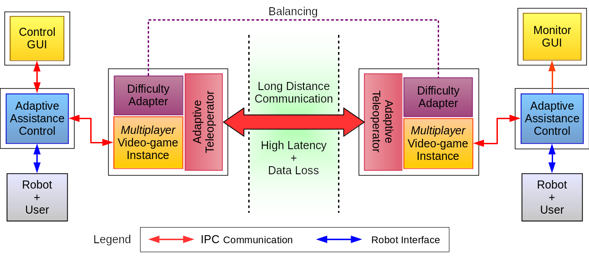
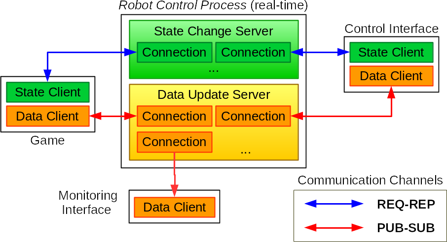

  
  

***
***

<h1 align="center">RobotSystem-Lite</h1>

***
***

## Overview

**RobotSystem-Lite** is a lightweight customizable robotic control application, with few third-party dependencies, for easier deployment in embedded systems. Its generic programming and communication interfaces allows it to integrate with a variety of client applications (for remote comunication) and custom plugins (for implementing specific control algorithms and robotic hardware I/O support).

  

  (High-level RobotSystem-Lite interfacing examples)

[Its original goal](https://www.teses.usp.br/teses/disponiveis/18/18149/tde-01062020-111015/en.php) has been enabling the combination of robotic rehabilitation with alternative approaches for physical therapy, like remote assistance and multiplayer "serious" video-games, where user engagement is modeled as proportional to external/environmental **Impedance** (**Inertia**, **Damping** and **Stiffness**), estimated using the [**least squares** method](https://en.wikipedia.org/wiki/Least_squares).

  

  (One of proposed RobotSystem-Lite usages)

  

  (Continuous impedance parameters estimation as link between robotic control and integrated applications)

However, its configuration flexibility is intended for allowing other usages of robotic control besides rehabilitation.

## Robot Multi-Level Configuration

In an effort to generalize and parameterize robot control in and efficient way, wherever it makes sense, and facilitate implementation of device specific behaviour, when needed, **RobotSystem-Lite** defines a multi-layer robot configuration scheme.

  

From top to bottom levels, the control application is expected to have/define:

- The base robot instance (only 1 per control process), constituted by:
    - A [robot configuration](https://AeroTechLab.github.io/RobotSystem-Lite/robot_config.html) JSON file (inside **<root_dir>/config/robots/**), defining its used high-level control implementation and actuator IDs
    - The robot+actuators controller itself, implemented as a plug-in library (inside **<root_dir>/plugins/robot_control/**), according to [Robot Control Interface](https://github.com/AeroTechLab/Robot-Control-Interface) description
    - A list of generic actuators, with each one, in turn, composed of:
        - An [actuator configuration](https://AeroTechLab.github.io/RobotSystem-Lite/actuator_config.html) JSON file (inside **<root_dir>/config/actuators/**), defining sensors and motor configuration IDs, their related control variables (position, force, etc.) and measurement deviations, as well as logging options
        - A [Kalman filter](https://en.wikipedia.org/wiki/Kalman_filter) for sensor fusion and complete joint state estimation 
        - A list of sensor IDs, each one, in turn, composed of:
            - [Sensor configuration](https://AeroTechLab.github.io/RobotSystem-Lite/sensor_config.html) JSON file (inside **<root_dir>/config/sensors/**), defining input sources inline configuration, inputs-output conversion expression and logging options
            - A list of input sources, for which the configuration file defines:
              - The signal input code itself, implemented as a plug-in library (inside **<root_dir>/plugins/signal_io/**), according to [Signal I/O Interface](https://github.com/AeroTechLab/Signal-IO-Interface) description
              - Signal processing/conversion options
        - Generic actuation motor, composed of:
            - [Motor configuration](https://AeroTechLab.github.io/RobotSystem-Lite/motor_config.html) JSON file (inside **<root_dir>/config/motors/**), defining the hardware/virtual output device/channel, reference input inline configuration (if needed), output conversion expression and logging options
            - The signal output code itself, implemented as a plug-in library (inside **<root_dir>/plugins/signal_io/**), according to [Signal I/O Interface](https://github.com/AeroTechLab/Signal-IO-Interface) description
            - A optional reference input, for which the configuration file defines:
              - The signal input code itself, implemented as a plug-in library (inside **<root_dir>/plugins/signal_io/**), according to [Signal I/O Interface](https://github.com/AeroTechLab/Signal-IO-Interface) description
              - Signal processing/conversion options

With that structure, a multi-level control process can interact with external clients through a single interface (for comprehending the difference between **joints** and **axes**, see [**Robot Control Interface** rationale](https://github.com/AeroTechLab/Robot-Control-Interface#the-jointaxis-rationale)):

  

## Communication Interfaces

**RobotSystem-Lite** client applications communicate with it through a provided [IPC](https://en.wikipedia.org/wiki/Inter-process_communication) implementation (based on methods like [shared memory](https://en.wikipedia.org/wiki/Shared_memory), [**IP** sockets](https://en.wikipedia.org/wiki/Network_socket), [nanomsg](https://github.com/nanomsg/nng) or [ROS2](https://github.com/ros2/rcl)), with fixed-size **512 bytes** messages. Depending on the type of message sent or received, a specific data format and underlying transport/protocol is used.

  

### State change messages

Messages requesting state changes or information about the robot are sent by clients occasionally and their arrival should be as guaranteed as possible. Therefore, these messages are transmitted using a [request-reply](https://en.wikipedia.org/wiki/Request%E2%80%93response) protocol. Possible messages (and corresponding reply values) are listed in a [separate header](https://AeroTechLab.github.io/RobotSystem-Lite/shared__robot__control_8h.html)

### Axes update messages

Messages transporting online updates for robot degrees-of-freedom ([axes (not joints)](https://github.com/AeroTechLab/Robot-Control-Interface#the-jointaxis-rationale)) control variables (measurements or setpoints) should arrive as quickly as possible, and there is no advantage in resending lost packets, as their validity is short in time. Thereby, these messages are exchanged with **RobotSystem-Lite** through lower-latency and scalable [publisher-subscriber](https://en.wikipedia.org/wiki/Publish%E2%80%93subscribe_pattern) connections (possibly with [broadcast](https://en.wikipedia.org/wiki/Multicast)), in a [defined format](https://AeroTechLab.github.io/RobotSystem-Lite/shared__dof__variables_8h.html).

### Control variables conventions

In order to keep consistency across developed [**robot control**](https://github.com/AeroTechLab/Robot-Control-Interface) and [**signal I/O**](https://github.com/AeroTechLab/Signal-IO-Interface) plug-ins and configuration files, and allow easier interoperation between them, the following unit conventions for control variables (input and output) are adopted:  

Control Variable |        Translational Unit       |              Rotational Unit
:--------------: | :-----------------------------: | :------------------------------------------:
Position         | meter (m)                       | radian (rad)
Velocity         | meter / second (m/s)            | rad / second (rad/s)
Force/Torque     | Newton (N)                      | Newton x meter (N.m)
Acceleration     | meter / second² (m/s²)          | radian / second² (rad/s²)
Stiffness        | Newton / meter (N/m)            | Newton x meter / radian (N.m/rad)
Damping          | Newton x second / meter (N.s/m) | Newton x meter x second / radian (N.m.s/rad)
Inertia          | kg (N.s²/m)                     | kg.m² (N.m.s²/rad)

## Building

On a terminal, get the [GitHub code repository](https://github.com/AeroTechLab/RobotSystem-Lite) with:

    $ git clone https://github.com/AeroTechLab/RobotSystem-Lite [<my_system_folder>]

Besides operating system's libraries, this software is dependent on code from other projects: [Data Logging](https://github.com/AeroTechLab/Simple-Data-Logging), [Kalman Filter](https://github.com/AeroTechLab/Simple-Kalman-Filter), [Plugin Loader](https://github.com/AeroTechLab/Plugin-Loader), [Robot Control Interface](https://github.com/AeroTechLab/Robot-Control-Interface), [Signal I/O Interface](https://github.com/AeroTechLab/Signal-IO-Interface), [Signal Processing](https://github.com/AeroTechLab/Simple-Signal-Processing), [Multithreading](https://github.com/AeroTechLab/Simple-Multithreading), [Precise Timing](https://github.com/AeroTechLab/Precise-Timing), [System Linearizer](https://github.com/AeroTechLab/Simple-System-Linearizer), [Tiny Expr](https://github.com/codeplea/tinyexpr) and [WinGetOpt](https://github.com/alex85k/wingetopt) (for Windows builds). Those are automatically linked as [git submodules](https://chrisjean.com/git-submodules-adding-using-removing-and-updating/).

To add those repositories to your sources, navigate to the root project folder and clone them with:

    $ cd <my_system_folder>
    $ git submodule update --init --recursive

(Or simply clone the main repository with the `--recursive` option)

Also, a [BLAS/LAPACK API](https://en.wikipedia.org/wiki/LAPACK) system library and implementations of [Data I/O Interface](https://github.com/AeroTechLab/Data-IO-Interface) and [IPC Interface](https://github.com/AeroTechLab/IPC-Interface) are needed.

To add the latter, run the following from the root project folder:

    $ git clone <my_data-io_implementation_repo> src/data_io --recursive
    $ git clone <my_ipc_implementation_repo> src/ipc --recursive
    
Example implementations are [Data I/O JSON](https://github.com/AeroTechLab/Data-IO-JSON) and [Simple Async IPC](https://github.com/AeroTechLab/Simple-Async-IPC).
    
With dependencies set, you can now build the system executable to a separate build directory with [CMake](https://cmake.org/):

    $ mkdir build && cd build
    $ cmake .. # or ccmake for more options
    $ make

## Running

Executing **RobotSystem-Lite** from command-line allows taking some optional arguments:

    $ ./RobRehabControl [--root <root_dir>] [--addr <connection_address>] [--log <log_dir>] [--config <robot_name>]

- **<root_dir>** is the absolute or relative path to the directory where **config** and **plugins** folders are located (default is working directory **"./"**)
- **<connection_address>** is the **IP** address the server sockets will be binded to (default is any address/all interfaces)
- **<log_dir>** is the absolute or relative path to the directory where log folders/files will be saved (default is **"./log/"**)
- **<robot_name>** is the name (without extensions) of the [robot configuration](https://AeroTechLab.github.io/RobotSystem-Lite/robot_config.html) file to be loaded on startup (configuration could be set or changed later via client applications)

## Documentation

Doxygen-generated detailed reference is available on project's [GitHub Pages](https://AeroTechLab.github.io/RobotSystem-Lite/files.html)
